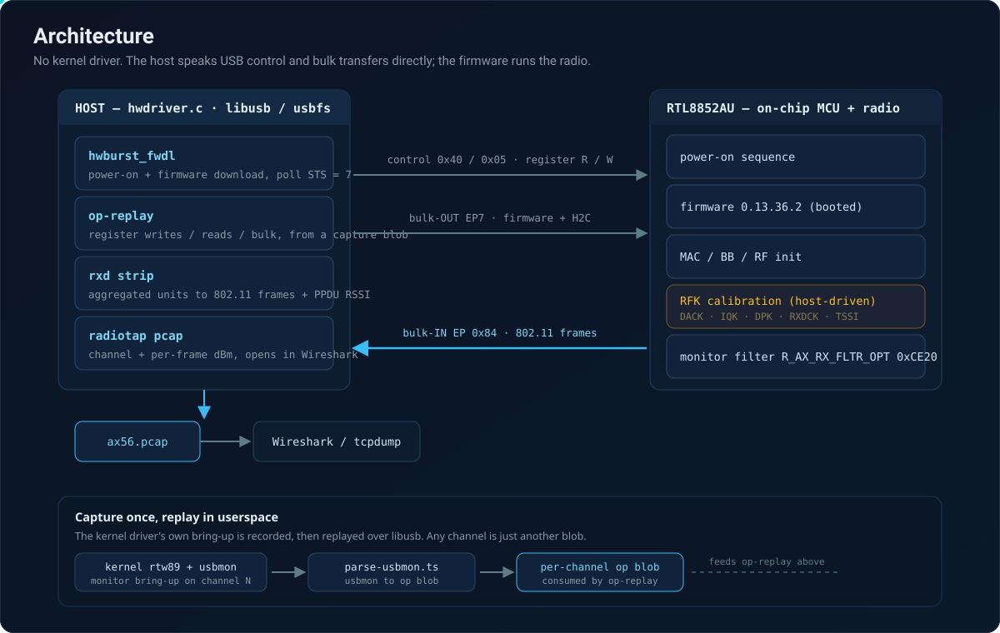

<p align="center">
  
</p>

<p align="center">
  
  
  
  
  
</p>

Userspace, no-root monitor mode for the **Realtek RTL8852AU** (WiFi 6, as found in the ASUS USB-AX56). The
adapter is driven entirely from user space over `libusb` / `usbfs`: the firmware is downloaded, the radio is
brought up, and live 802.11 frames are read back and written to a radiotap `pcap` that opens in Wireshark. No
kernel module is loaded and no elevated wireless stack is required beyond claiming the USB interface.

To the best of our knowledge this is the first no-root userspace monitor path for the 8852A family. The vendor
and mainline `rtw89` drivers are kernel modules, and OpenIPC's Devourer explicitly excludes the 8852A family, so
until now the only way to sniff with this chip was a kernel driver running as root.

---

## Highlights

| Capability | Detail |
|---|---|
| Firmware download | Full on-chip bring-up (`hwburst_fwdl`) to `STS = 7 BOOTED`, no kernel driver |
| Live 802.11 capture | Real beacons and management frames off bulk-IN endpoint `0x84` |
| Radiotap + RSSI | Per-frame channel and dBm signal, decoded straight from the PPDU status |
| Wireshark ready | Frames are written to a standard radiotap `pcap` |
| Channel hopping | Any channel is just another captured-and-replayed bring-up blob |
| Honest scope | Monitor **receive** only; deauth / injection are intentionally not provided |

---

## Architecture

<p align="center">
  
</p>

The host never guesses the thousands of MAC / BB / RF and calibration register values the chip needs. Instead,
the kernel `rtw89` driver's own bring-up is recorded once with `usbmon`, turned into a compact operation stream,
and then replayed verbatim from user space. The firmware download itself is the one part that is reconstructed
natively (`hwburst_fwdl`), because it must run from a cold power state; everything after it is a faithful replay
of register writes, gated reads, and bulk transfers. RF calibration on the 8852A is host-driven, and the
captured coefficients belong to the very same silicon, so replaying them retunes the radio correctly.

Once the radio is up and the monitor filter (`R_AX_RX_FLTR_OPT`, `0xCE20`) is set, 802.11 frames arrive on
bulk-IN endpoint `0x84`, aggregated several to a transfer. Each unit's rx descriptor is stripped to recover the
frame; the accompanying PPDU-status unit carries the RSSI. Frames go out as a radiotap `pcap`.

---

## How it works

1. **Firmware download.** From a cold chip, `hwburst_fwdl` runs the power-on plus DMAC / DLE setup, patches the
   firmware header part size, bursts all sections over bulk-OUT endpoint `0x07`, and polls until the MCU reports
   `WCPU_FW_INIT_RDY`.
2. **Bring-up replay.** The captured operation stream (register writes, spin-loop polls, bulk H2C) is replayed
   to run the MAC / BB / RF initialisation, host-side RF calibration (DACK, IQK, DPK, RXDCK, TSSI), the channel
   set, and the monitor / sniffer filter.
3. **Receive.** Bulk-IN endpoint `0x84` delivers aggregated rx units. The driver walks each unit
   (`frame offset = rxd length + drv_info + shift`), extracts the 802.11 frame, and reads per-path RSSI from the
   PPDU-status unit's PHY header (`signal = (max(rssi_a, rssi_b) >> 1) - 110`, matching `rtw8852a_query_ppdu`).
4. **Output.** Each frame is written to `ax56.pcap` as `DLT_IEEE80211_RADIOTAP` with the channel frequency and
   the dBm signal, ready for Wireshark or `tcpdump`.

---

## Quick start

**Requirements:** Linux, `libusb-1.0` + `pkg-config`, a C compiler, and an ASUS USB-AX56 (or another RTL8852AU
adapter, USB id `0b05:1997` after its mode switch). The Realtek firmware blob is **not** redistributed here; it
is extracted from the vendor driver (`hal8852a_fw.c`, cut 2 / nic variant) and placed next to the replay blob.

```sh
# build
cd tool
gcc -O2 -o hwdriver hwdriver.c $(pkg-config --cflags --libs libusb-1.0)

# replay a captured bring-up (channel 6) and read live beacons into ax56.pcap
sudo ./hwdriver replay.bin 2322184 hb
```

The trailing arguments are the replay blob, the byte offset of the last bring-up cycle's tail, and `hb` to run
the native firmware download first. A warm chip that failed a previous run aborts cleanly and asks for a cold
replug; a fresh, cold adapter gives the cleanest capture.

---

## Channel hopping

Changing channel on the 8852A is a full host-driven RF recalibration, not a single register poke, so a channel
is captured and replayed as a complete, self-contained bring-up. No change to `hwdriver` is needed.

```sh
# 1. capture the kernel driver bringing the adapter up in monitor mode on the target channel
sudo sh -c 'tcpdump -i usbmon1 -w full_ch1.pcap -s0 & \
  modprobe -i rtw89_core; modprobe -i rtw89_usb; modprobe -i rtw89_8852a; modprobe -i rtw89_8852au; \
  sleep 4; IF=$(ls /sys/class/net | grep wlp0s20 | head -1); \
  ip link set $IF down; iw dev $IF set type monitor; ip link set $IF up; iw dev $IF set channel 1; \
  sleep 2; kill %1'

# 2. turn the capture into a replay blob (prints the tail offset to replay from)
deno run --allow-read --allow-write tool/parse-usbmon.ts full_ch1.pcap full_ch1.bin

# 3. release the kernel driver and replay in userspace
sudo modprobe -r rtw89_8852au rtw89_8852a rtw89_usb rtw89_core
sudo ./tool/hwdriver full_ch1.bin <tail-offset> hb
```

A cold channel-1 run captured 138 beacons: 113 on channel 1, 27 on channel 2, and none on channel 6, with the
channel-6 access points that dominate every channel-6 capture completely absent. The receiver really retuned.

---

## Status

| Stage | State |
|---|---|
| Enumerate, mode switch, register R/W | Proven on hardware |
| Power-on, DMAC / DLE, firmware download | Proven, `STS = 7 BOOTED` |
| MAC / BB / RF init + RF calibration | Proven via captured replay |
| Monitor receive, real beacons | Proven, decoded by Wireshark |
| Radiotap channel + per-frame RSSI | Proven, cross-checked against the kernel driver |
| Channel hopping | Proven (per-channel capture + replay) |
| Transmit / injection | Not provided (out of scope) |

---

## Honest limitations

- **Receive-only monitor.** A generic bulk-OUT primitive exists, but deauth and injection are deliberately not
  built; this is a defensive / research sniffer.
- **Replay-based.** The tool replays a captured bring-up; producing a blob for a new channel needs one capture
  of the kernel driver on that channel. The firmware download itself is native and needs no capture.
- **Cold start matters.** A freshly plugged (cold) adapter gives the fullest, cleanest capture; warm reruns can
  catch fewer frames.
- **One silicon, one bench.** Everything here was validated on real hardware, but calibration data is per-chip;
  captures are meant to be regenerated on your own adapter.

---

## Repository layout

```
tool/
  hwdriver.c        no-root userspace firmware download + monitor RX (libusb)
  parse-usbmon.ts   turn a usbmon capture into a replay blob (Deno)
  ax56ctl.sh        enumerate / identify / mode-switch / register R-W helper
  ax56.ts           WebUSB viewer helper
  fw-validate.ts    firmware header / section parser and validator
docs/
  banner.svg        title and adapter illustration
  architecture.svg  data-flow diagram
```

---

## Credits and license

Derived from the register sequences and constants of [`lwfinger/rtl8852au`](https://github.com/lwfinger/rtl8852au)
and mainline `rtw89`; licensed **GPL-2.0**. The firmware is Realtek's property and is not included in this
repository. This project is for interoperability, education, and defensive security research.
