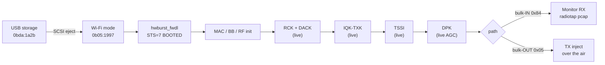
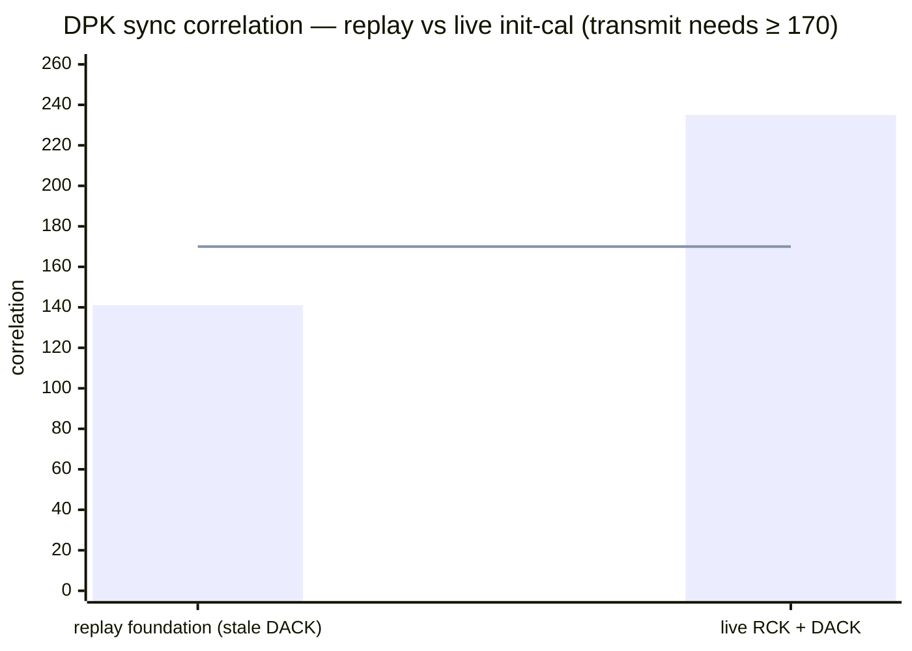

<p align="center">
  
</p>

<p align="center">
  
  
  
  
  
  
</p>

Userspace, **no-root** driver for the **Realtek RTL8852AU** (Wi-Fi 6, as found in the ASUS USB-AX56). The
adapter is driven entirely from user space over `libusb` / `usbfs` — no kernel module, no elevated wireless
stack beyond claiming the USB interface. It brings the radio up, sniffs live 802.11 into a radiotap `pcap`,
hops channels across the whole 2.4 / 5 GHz range, and — as of the transmit work below — **injects 802.11
frames over the air**, verified on a separate receiver.

To the best of our knowledge this is the first no-root userspace driver for the 8852A family to do either
monitor **or** transmit. The vendor and mainline `rtw89` drivers are kernel modules, and OpenIPC's Devourer
explicitly excludes the 8852A, so until now the only way to work with this chip was a kernel driver as root.

---

## Capabilities

| Capability | Status | Detail |
|---|:--:|---|
| Mode switch (storage → Wi-Fi) | ✅ | SCSI eject of the `0bda:1a2b` CD image → re-enumerates as `0b05:1997` |
| Firmware download | ✅ | Cold on-chip bring-up (`hwburst_fwdl`) to `STS = 7 BOOTED` |
| Monitor RX | ✅ | Real beacons / mgmt / data off bulk-IN `0x84`, rx-descriptor stripped |
| Radiotap + RSSI | ✅ | Per-frame channel and dBm from the PPDU status; opens in Wireshark |
| Channel hopping | ✅ | All 39 channels (2.4 + 5 GHz); fast warm delta |
| **TX / injection** | ✅ | **Raw 802.11 frames radiated over the air, confirmed by a second receiver** |
| Attack tooling (deauth, …) | ⛔ | Intentionally **not** provided — see [Scope](#scope--ethics) |

---

## The pipeline



Everything to the left of the calibrations is deterministic and is replayed from a recorded kernel bring-up.
Everything from `RCK` onward is executed **live** on the chip — that distinction is the whole story of the
transmit path.

---

## The transmit breakthrough

Monitor **receive** tolerates replay: the receive settings are just register values, so a recording of the
kernel's bring-up can be played back verbatim. **Transmit does not.** The power amplifier must be physically
calibrated, and that calibration is an *analog* measurement the chip performs on itself — writing back a
recorded result does not put the silicon in the calibrated state, so the PA never keys up.

The fix is to run the calibration chain **live** from user space, in the kernel's order, on top of a proven
RF-register write path. The final missing link was the init-time **DACK** (ADC/DAC DC calibration): replaying
its stale per-chip coefficients left the front-end's DC baseline wrong, which corrupted the DPK loopback tone.
Running `RCK` + `DACK` live restored it — and the DPK sync correlation snapped to the kernel's own level, so
the AGC converged and the amplifier turned on:



With `corr = 235` the transmitter radiates. A separate Intel monitor caught **899 of 900** injected probe
requests over the air at **−30 dBm**.

---

## Quick start

```sh
# build (host with libusb-1.0 + pkg-config)
gcc -O2 -o hwdriver tool/hwdriver.c $(pkg-config --cflags --libs libusb-1.0)

# monitor RX on channel 6 (needs the cut-2 nic firmware blob + a capture blob alongside)
sudo ./hwdriver full_ch6.bin <tail-offset> hb          # -> beacons to /tmp/ax56.pcap (radiotap)

# identify / mode-switch / poke registers without libusb, via termux-usb on Android
tool/ax56ctl.sh list
tool/ax56ctl.sh switch <dev>
tool/ax56ctl.sh reg    <dev> 0x1e0
```

Channel hopping is just a different bring-up blob — capture a kernel monitor session on the target channel,
parse it with `tool/parse-usbmon.ts`, and replay its tail.

---

## How it works

1. **Firmware download.** From a cold chip, `hwburst_fwdl` runs power-on + DMAC/DLE setup, patches the firmware
   header part size, bursts every section over bulk-OUT `0x07`, and polls until `WCPU_FW_INIT_RDY`.
2. **Bring-up (replay).** The kernel `rtw89` monitor bring-up is recorded once with `usbmon`, turned into a
   compact op stream (writes, gated reads, bulk transfers), and replayed verbatim — thousands of MAC/BB/RF
   register values the host never has to understand.
3. **Live calibration.** `RCK`, `DACK`, `IQK-TXK`, `TSSI` and `DPK` are ported from `rtw8852a_rfk.c` and run
   live against this chip's own analog measurements — the part replay cannot reproduce.
4. **Receive.** Monitor filter `R_AX_RX_FLTR_OPT` (`0xCE20`) set; frames arrive aggregated on bulk-IN `0x84`,
   each rx descriptor stripped, RSSI from the PPDU status, written to a radiotap `pcap`.
5. **Transmit.** A `[txdesc][802.11 frame]` packet on bulk-OUT `0x05` — the same endpoint the kernel uses —
   radiates once the live calibration has keyed the PA.

See [`docs/`](docs/) for the register-level research notes.

---

## Status

| Stage | State |
|---|---|
| Enumerate · mode switch · register R/W | Proven on hardware |
| Power-on · DMAC/DLE · firmware download | Proven — `STS = 7 BOOTED` |
| MAC / BB / RF init + monitor | Proven — real beacons, Wireshark-decoded |
| Radiotap channel + per-frame RSSI | Proven — cross-checked vs the kernel driver |
| Channel hopping (39 channels) | Proven — per-channel bring-up |
| Live TX calibration (RCK/DACK/IQK/TSSI/DPK) | Proven — DPK converges from user space |
| **Transmit / injection** | **Proven on the air — 899/900 frames caught by a 2nd receiver** |

---

## Scope & ethics

This project provides a **monitor receiver** and a **raw-frame transmit primitive** for research, education
and interoperability on hardware you own. It deliberately ships **no** deauthentication, disassociation or
other denial-of-service / attack tooling. Use it only where you are authorized to.

---

## Credits

Register sequences and calibration logic are ported from the mainline Linux `rtw89` driver and
`lwfinger/rtl8852au`. Licensed **GPL-2.0** (see [`LICENSE`](LICENSE)); the firmware blob is not redistributed.
